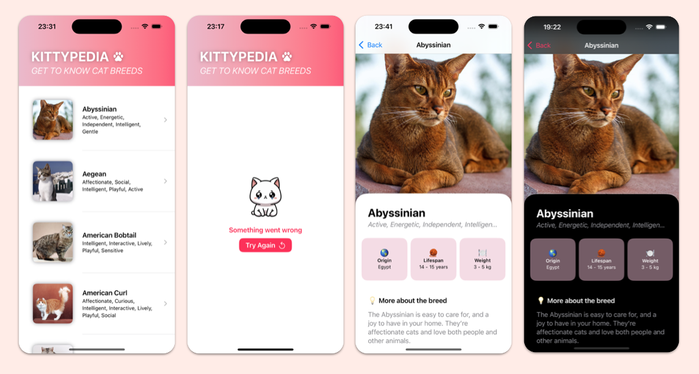

# Kittypedia 🐱

## Overview
Kittypedia is a simple iOS app that displays a list of cat breeds and detailed information about each breed. The app fetches data from an external API and follows the MVVM architectural pattern. Built using **SwiftUI**, it provides a smooth and responsive user experience, including pagination and detailed breed characteristics.



## Features
- List of cat breeds with pagination
- Detailed breed information
- Lazy image loading for optimized performance
- Clean MVVM architecture for maintainability
- Uses `async/await` for network requests
- Supports dark mode
- Unit Tests (XCTest)
- UI Tests (XCTest)
- Error handling and UI responsive to errors


## 📲 Setup Instructions
1. Clone this repository:
   ```sh
   git clone https://github.com/your-repository/kittypedia.git
   ```
2. Open `Cats.xcodeproj` in Xcode.
3. Ensure you have Xcode 15+ installed.
4. Select a simulator or a physical device.
5. Run the app.

## 🏗️ Architecture
Kittypedia follows the **MVVM** (Model-View-ViewModel) pattern:
- **Model**: Represents data structures (e.g., `Breed`, `BreedResponse`).
- **ViewModel**: Handles logic and API calls (e.g., `BreedsListViewModel`, `BreedDetailsViewModel`).
- **View**: SwiftUI views that display data (`BreedsListView`, `BreedDetailsView`).


## 🛠️ Dependencies
This project does not rely on third-party dependencies, ensuring maintainability.


## 🧪 Running Tests
After opening the project in XCode:

- Press `Command` + `U` to run all tests

Alternatively, go to **Test Navigator** and select the specific tests to run.
